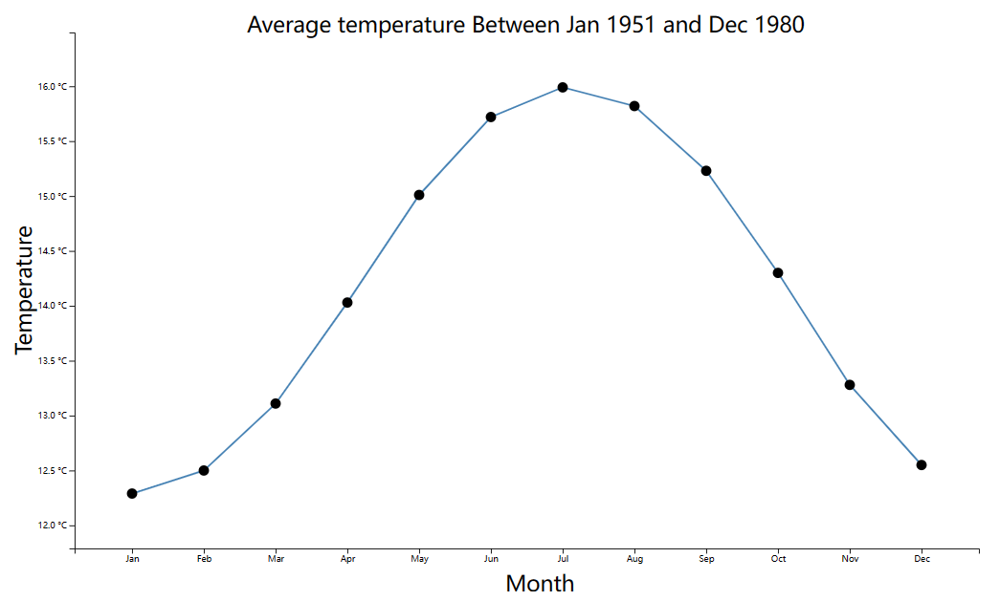
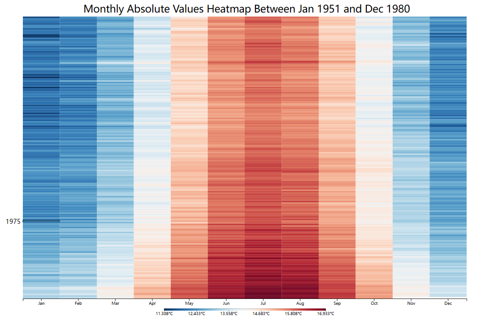
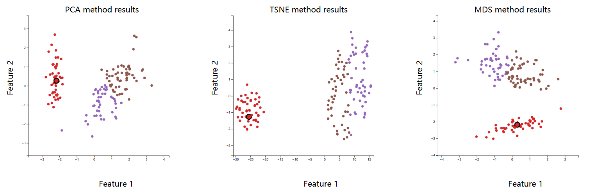

# ARTS1422 - Data - Visualization
This repository contains [homework](https://github.com/wangyf9/ARTS1422-Data-Visualization/tree/main/hw1) of the ATRS1422 course, spring, 2024 in Shanghaitech.

## HW1
- Mainly focus on learning basic uses of D3.js.
- Task 1
  - Create a line chart to represent the change in average monthly temperatures over the course of a year.
  - Mainly focus on **scale**, **axis**, **graph**.
  

- Task 2
  - Process the data read from the csv file and draw a heatmap to show the temperature for each month of the century.
  - Mainly focus on **scale**, **axis**, **graph**, **monitor**.

  
- Task 3
  - Describe the visualization and interesting patterns you find.

## HW2
- Mainly focused on visual interaction between images.
- Task 1
  - Data preprocessing by using three dimensional reduced methods
  - Use clustering method to re-export labels
  - Mainly focus on **K-means** **PCA** **TSNE** **MDS**
- Task 2
  - Use preprocessed data to make scatterplots and add interactions of the same data points in different plots.
  -  Mainly focus on  **axis**, **graph**, **monitor**.

